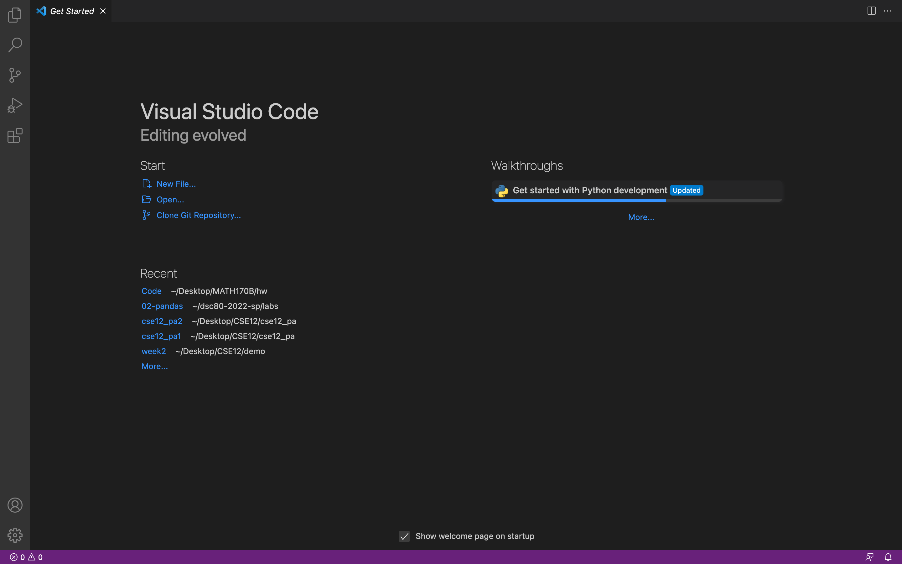
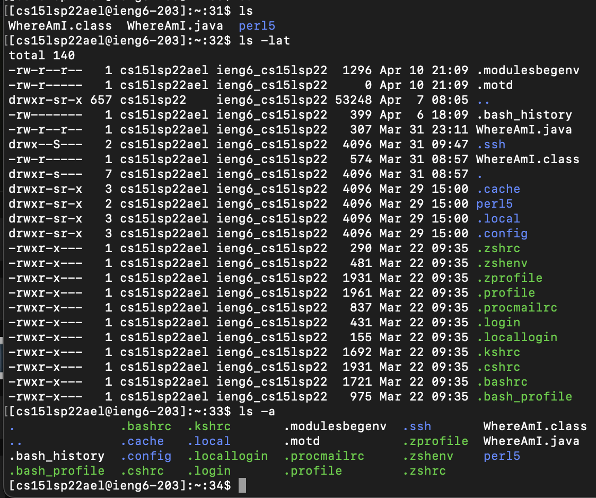
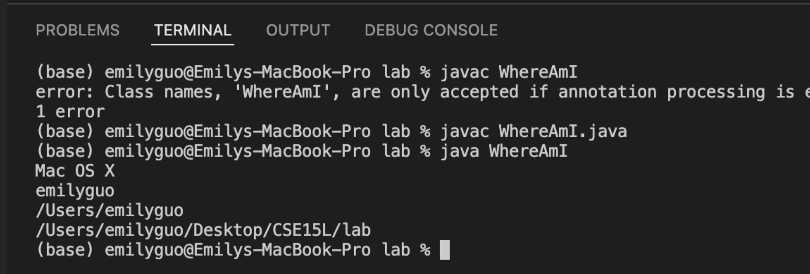
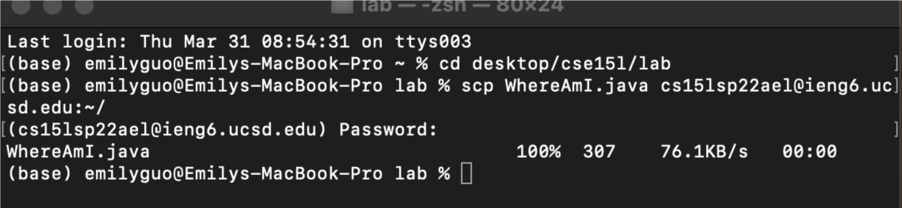
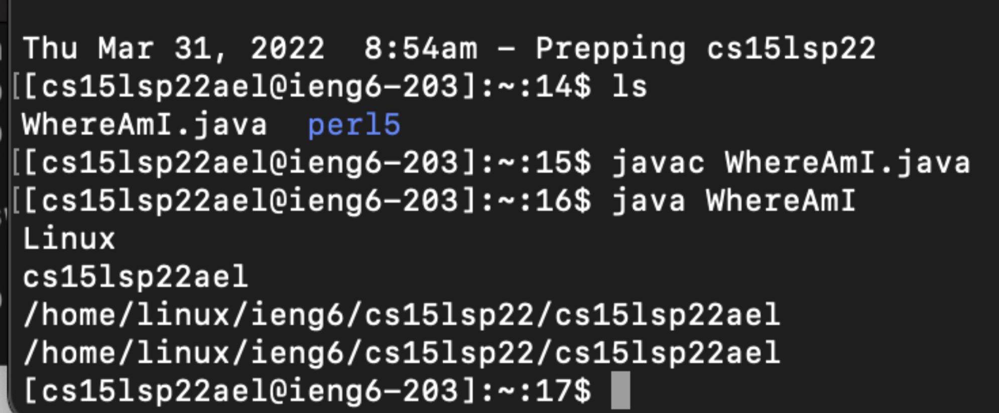
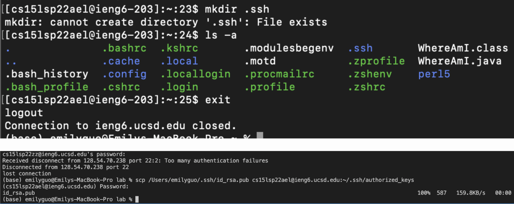
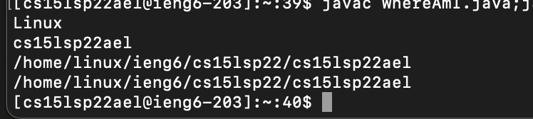

# Lab Report1 week2

### Installing VScode
- Download the dmg file to the computer and install the vscode application
- Open the application and is will show this page
- In the vscode we are also able to open the file in different format such as markdown, python, and java

<br>

### Remotely Connecting
- Connect to the remote computer through VSCode
- Open the terminal in VSCode and enter the comment `$ ssh cs15lsp22ael@ieng6.ucsd.edu`
- GIve the password to the account, then we successfully log into the account

<br>

### Trying Some Commands
- `cd` or `cd ~` move back to the main root
- `cd..` moves the directory back one directory
- `ls` list the existing files in the current directory
- `ls -a` list all the files in the directory, including all the hidden files (files that start with .)
- `ls -lat` list all the fileshidden files, including the , in the current directory in the descending order or their last open time
- `cp /home/linux/ieng6/cs15lsp22/public/filename.txt ~/` copy the filename.txt file from server public address into own account address
- `cat /home/linux/ieng6/cs15lsp22/public/filename.txt ~/` copy the content in filename.txt file from server public address into own account address

<br>

### Moving Files with scp
- Use `javac` to compile the java file and `java` to run the program

- Use `scp fileName.java cs15lsp22ael@ieng6.ucsd.edu:~/` to copy the local java file into the remote computer, and enter the password to ensure the log in status

- To check whether the file is in the remote computer or not, log into the remote account again and `ls` to see the file in the directory
- Then should be able to compile and run the file on the remote computer

<br>

### Setting an SSH Key
- Setting SSH Key creates a pair of public key and private key
> Local Computer

```
ssh-keygen
Generating public/private rsa key pair.
Enter file in which to save the key (/Users/emilyguo/.ssh/id_rsa): /Users/emilyguo/.ssh/id_rsa
Enter passphrase (empty for no passphrase): 
Enter same passphrase again: 
```
- Copy the file on to remote system using private key and public key stored
> Remote Computer

```
$ ssh cs15lsp22ael@ieng6.ucsd.edu
<Password>
$ mkdir .ssh
$ <logout>
```

> Local Computer (Copy local file into remote system)
```
$ scp /Users/amilyguo/.ssh/id_rsa.pub cs15lsp22ael@ieng6.ucsd.edu:~/.ssh/authorized_keys
```

<br>

### Optimizing Remote Running
`$ scp WhereAmI.java cs15lsp22ael@ieng6.ucsd.edu:~/; ssh cs15lsp22ael@ieng6.ucsd.edu; javac fileName.java; java fileName
`
- `scp fileName.java cs15lsp22ael@ieng6.ucsd.edu:~/;` Copy the local file into remote system
- `ssh cs15lsp22ael@ieng6.ucsd.edu;` Log into the remote system
- `javac fileName.java` Compile the java file
- `java fileName` Run the java program

<br>
