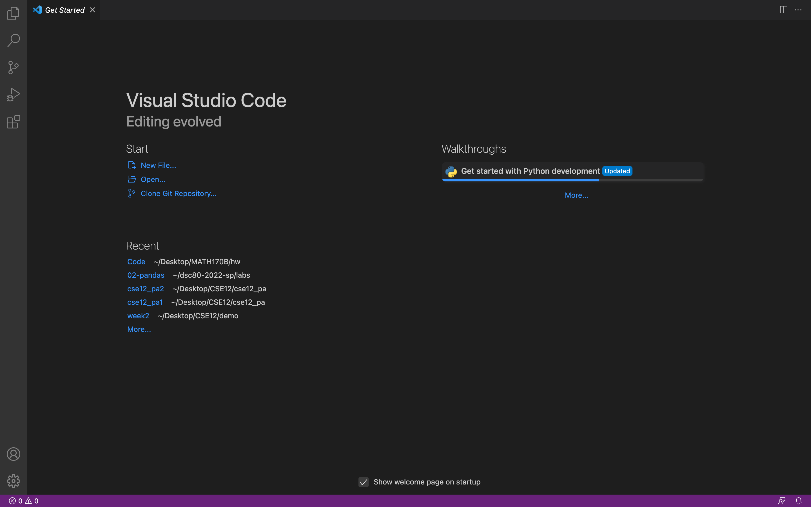
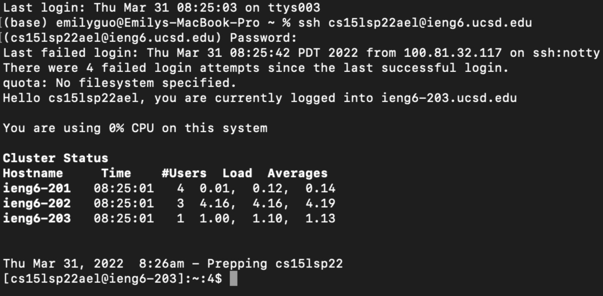

# Lab Report1 week2

### Installing VScode
- Download the dmg file to the computer and install the vscode application
- Open the application and is will show this page
- In the vscode we are also able to open the file in different format such as markdown, python, and java
- 
 

### Remotely Connecting
- Connect to the remote computer through VSCode
- Open the terminal in VSCode and enter the comment $ ssh cs15lsp22ael@ieng6.ucsd.edu
- GIve the password to the account, then we successfully log into the account
- 
 

### Trying Some Commands
 

### Moving Files with scp
 

### Setting an SSH Key
 

### Optimizing Remote Running
 
