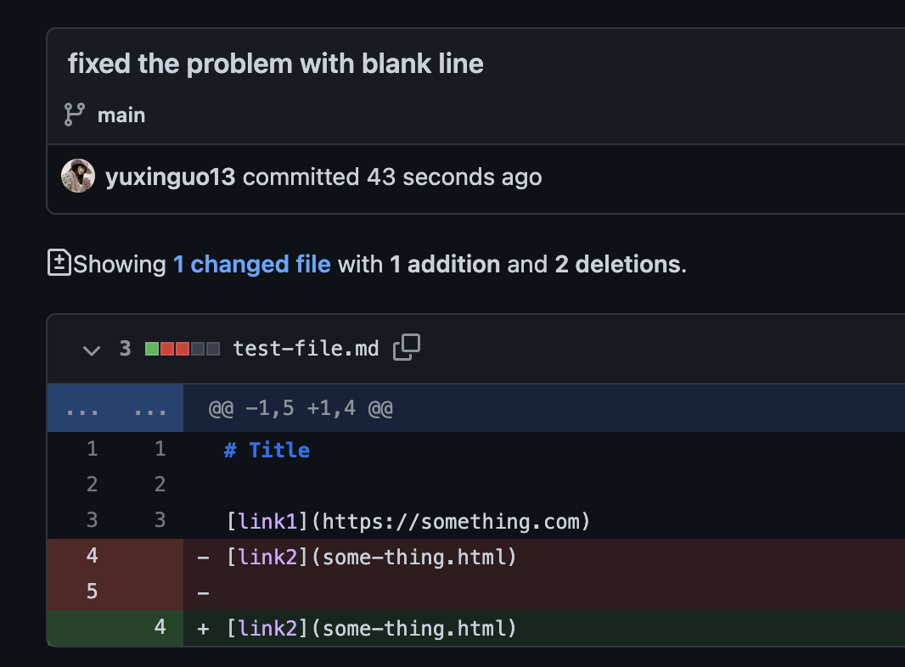
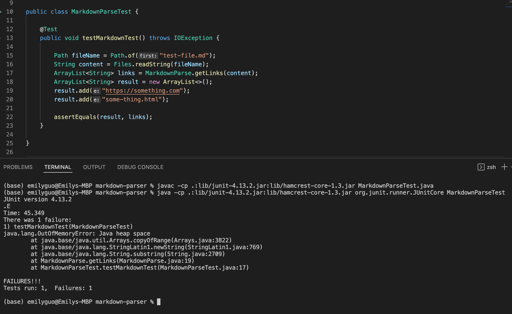
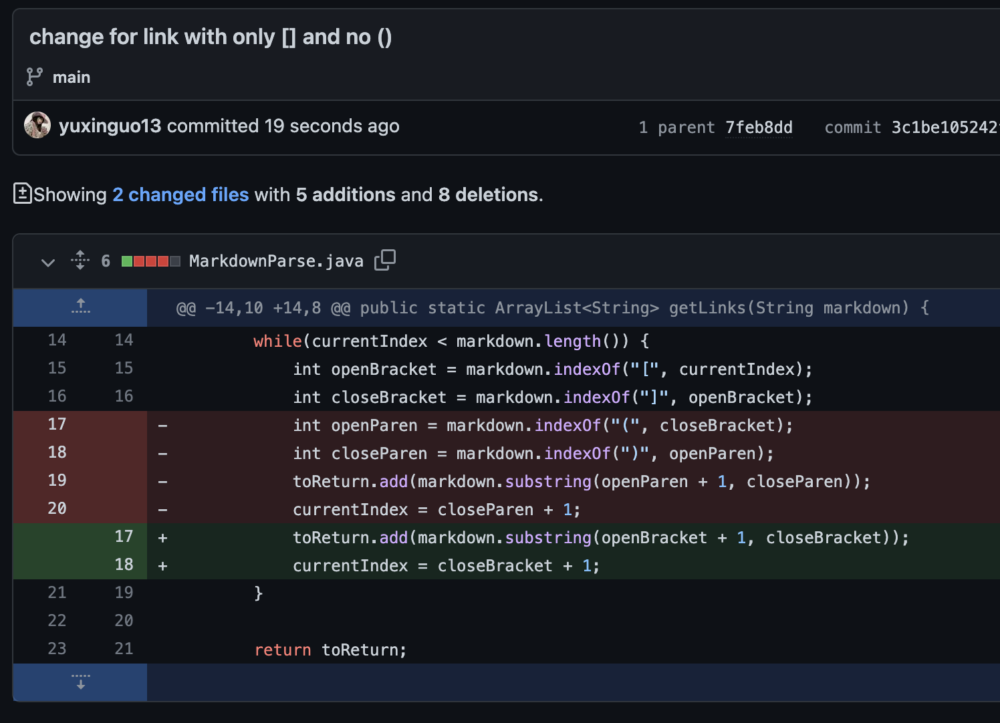
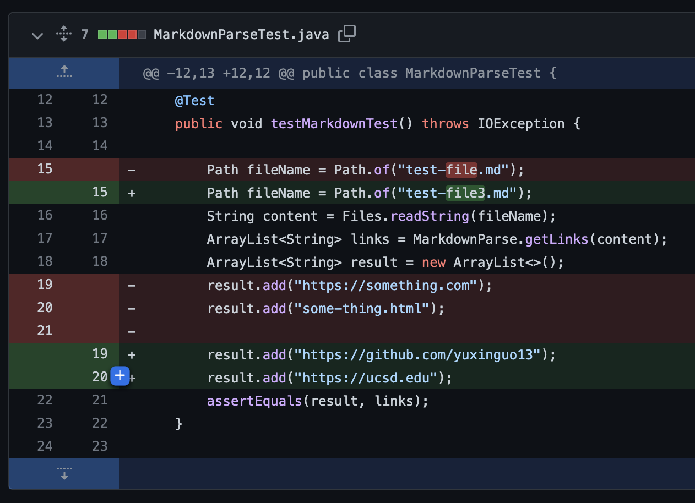
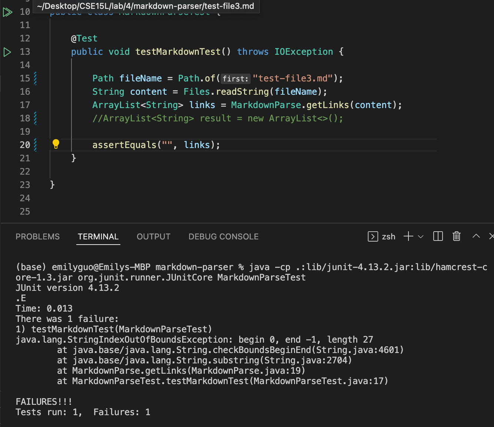
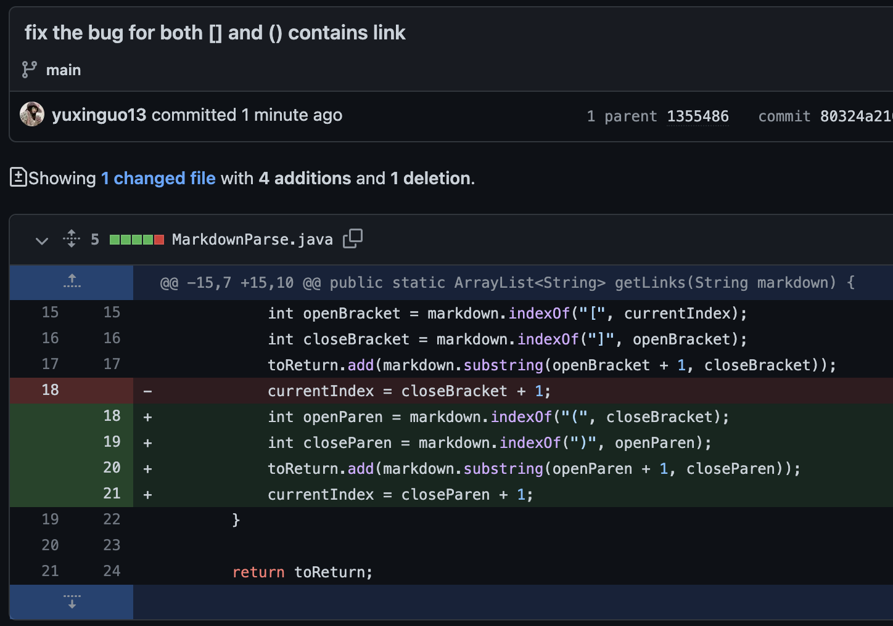
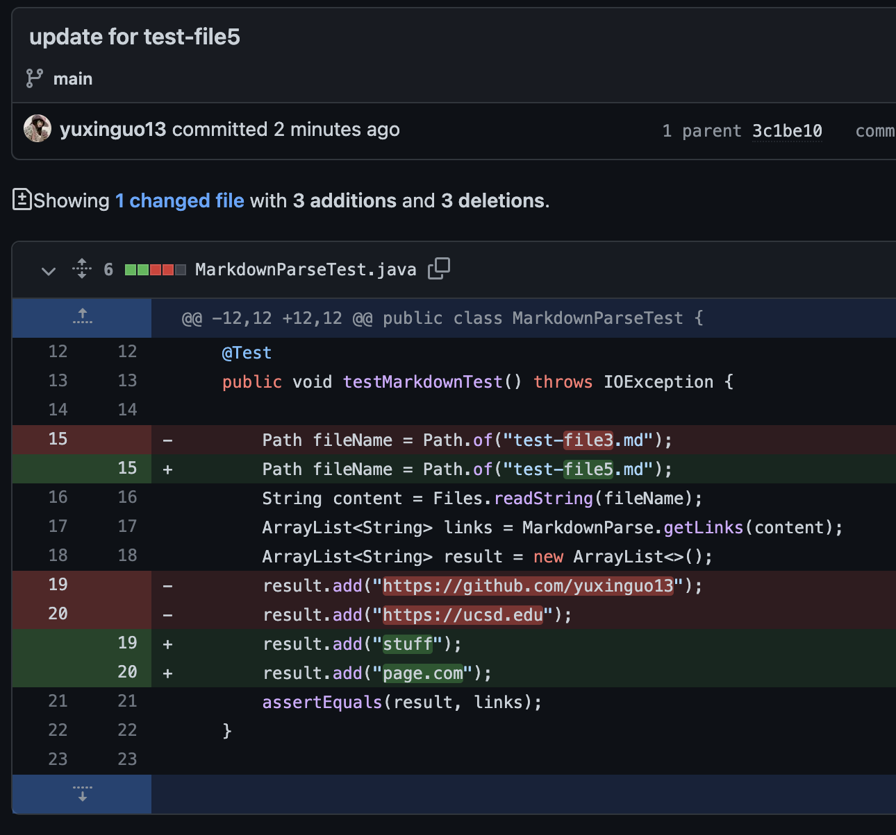
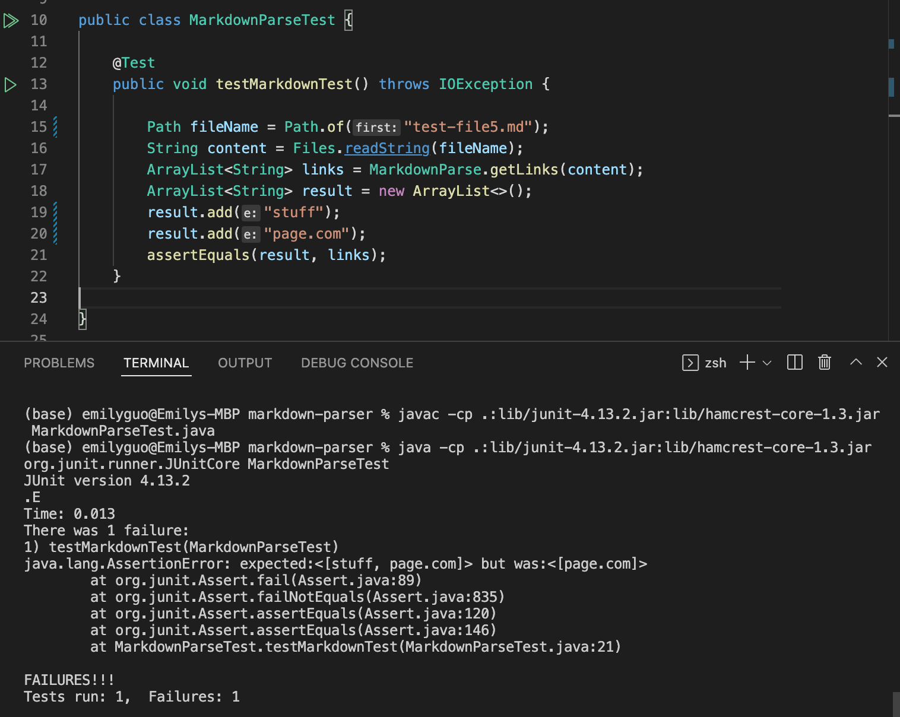

# Lab Report2 Week4
[Other reports here](https://yuxinguo13.github.io/cse15l-lab-reports/)

### First Change
- Code change

- Failure-including input: [test file 1](https://github.com/yuxinguo13/markdown-parser/blob/main/test-file.md)

- Symptom of the code: it shows the infinitly loop and lack of heap space

- Relationship between the bug, the symptom, and the failure-inducing input
  - There is a empty line at the end of the test file
  - But in the code, we do not have method to deal with the blank line at the end of the file.
  - The empty line leads to the infinitely loop erroe in the test, and the not enough heap space, which lead to the failure of the test.

### Second Change

- Code change

- Failure-including input: [test file 2](https://github.com/yuxinguo13/markdown-parser/blob/main/test-file3.md)

- Symptom of the code and test: the index of the arraylist is out of bound

- Relationship between the bug, the symptom, and the failure-inducing input
  - In this test file, we don't have the () and only have the brackets.
  - Thus, our previous code which also detect the () would not work in this case.
  - When we trying to obtain the substring within the (), the index given would out of index.
  - Therefore, we change the code to only check the substring within the [].

### THird Cahange

- Code change

- Failure-including input: [test-file-5](https://github.com/yuxinguo13/markdown-parser/blob/main/test-file5.md)

- Symptom of the code and test: the index of the arraylist is out of bound

- Relationship between the bug, the symptom, and the failure-inducing input

