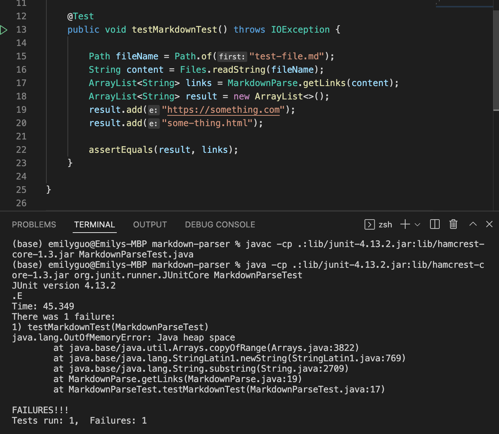

- Show a screenshot of the code change diff from Github (a page like this)
- Link to the test file for a failure-inducing input that prompted you to make that change
- Show the symptom of that failure-inducing input by showing the output of running the file at the command line for the version where it was failing (this should also be in the commit message history)
- Write 2-3 sentences describing the relationship between the bug, the symptom, and the failure-inducing input.

# Lab Report2 Week4
[Other reports here](https://yuxinguo13.github.io/cse15l-lab-reports/)

### First Change
- Code change

- Failure-including input: [test file 1](https://github.com/yuxinguo13/markdown-parser/blob/main/test-file.md)

- Symptom of the code

- Relationship between the bug, the symptom, and the failure-inducing input
  - There is a empty line at the end of the test file
  - But in the code, we do not have method to deal with the blank line at the end of the file.
  - The empty line leads to the infinitely loop erroe in the test, and the not enough heap space, which lead to the failure of the test.

### 2

- Code change

- Failure-including input: 

- Symptom of the code

- Relationship between the bug, the symptom, and the failure-inducing input

[test file 2](https://github.com/yuxinguo13/markdown-parser/blob/main/test-file3.md)

### 3
[test-file-5](https://github.com/yuxinguo13/markdown-parser/blob/main/test-file5.md)

