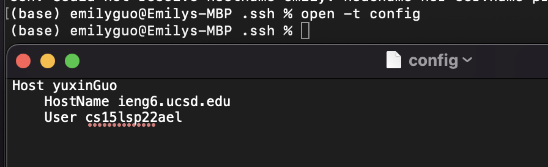
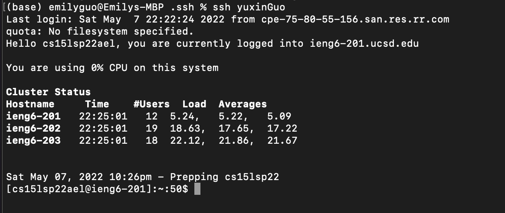
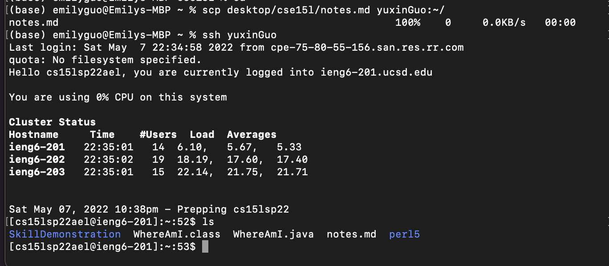
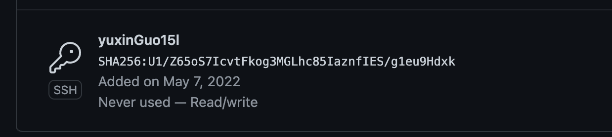
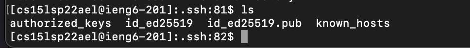
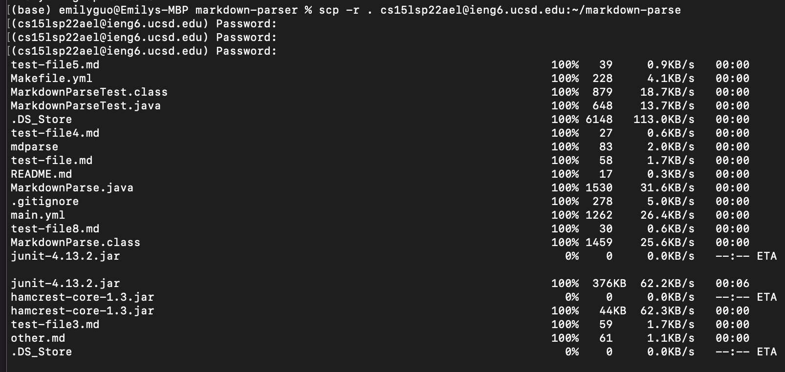
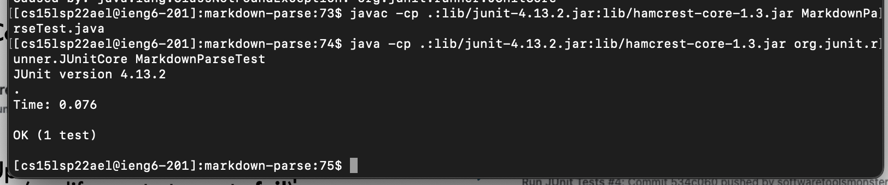
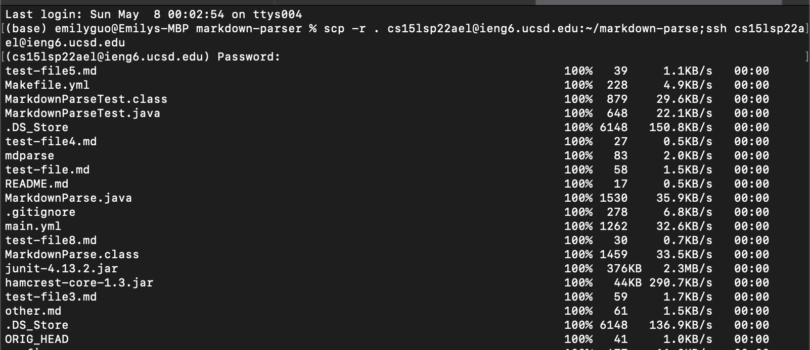

# Lab Report3 Week6
[Other reports here](https://yuxinguo13.github.io/cse15l-lab-reports/)

### Streaminglining ssh Configuration

- Open the config file in textEditor, and set the content of it.

- After changing the the config, and use an alis to represent my ieng6 account, I could log into the account using ssh + alis name

- These are files in my ieng6 account before I copy files into the account

- Files in my ieng6 account after copying files

### Setuo Github Access from ieng6
- show public key

- show private key

- git command

- link to commit

By changing the .ssh config and set a alis name to my ieng6 account, I could easily log into the account and do operations over the account.

### Copy whole directory using scp -r
- copy whole directory to ieng6 account

- log into account to check the folder

- compile and run the test

- doing copy and log into account in one step

