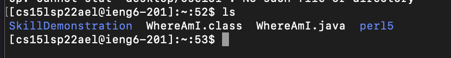

# Lab Report3 Week6
[Other reports here](https://yuxinguo13.github.io/cse15l-lab-reports/)

### Streaminglining ssh Configuration

- open config

- log into account using ssh

- before copy files in account

- after copy

### Setuo Github Access from ieng6
- show public key

- show private key

- git command

- link to commit

### Copy whole directory using scp -r
- copy whole directory to ieng6 account

- log into account to check the folder

- compile and run the test

- doing copy and log into account in one step

