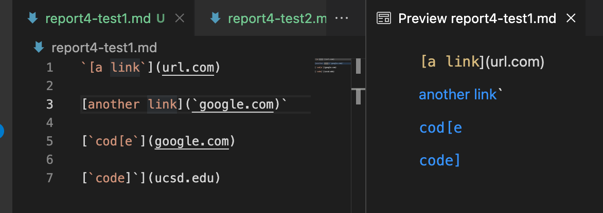
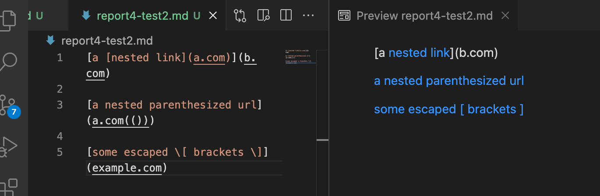
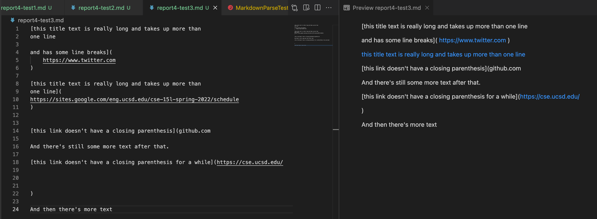
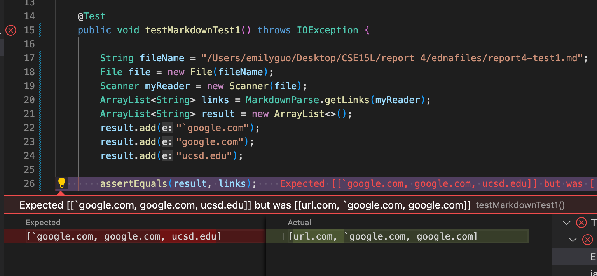
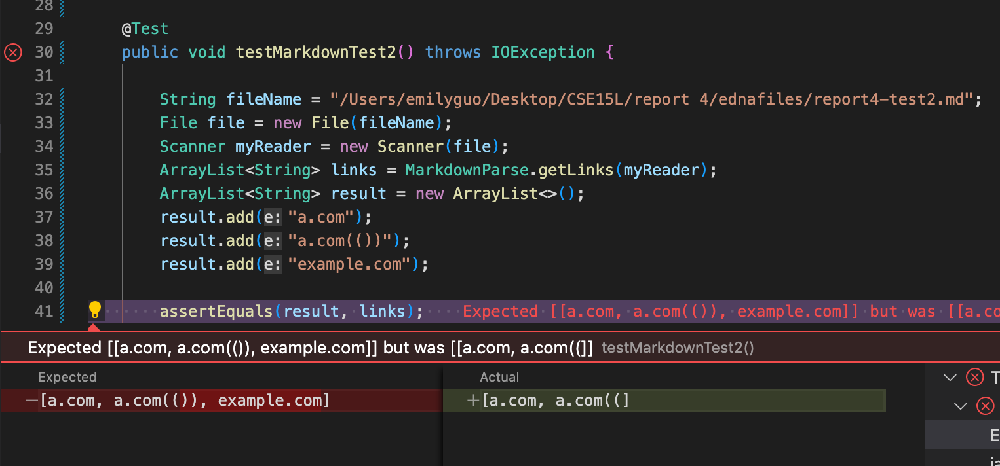
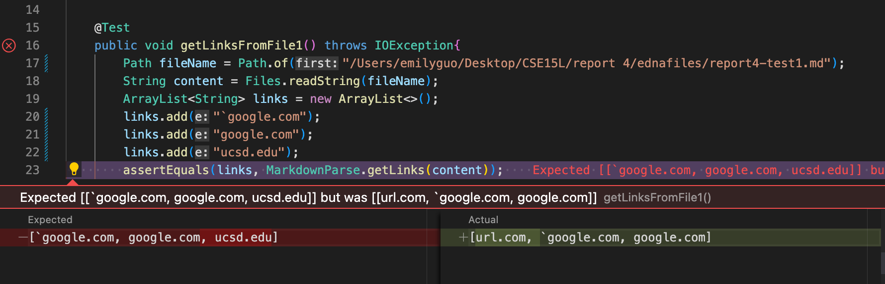
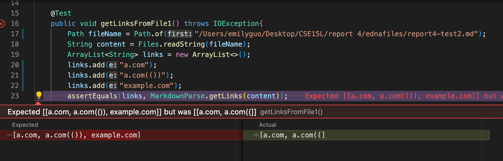
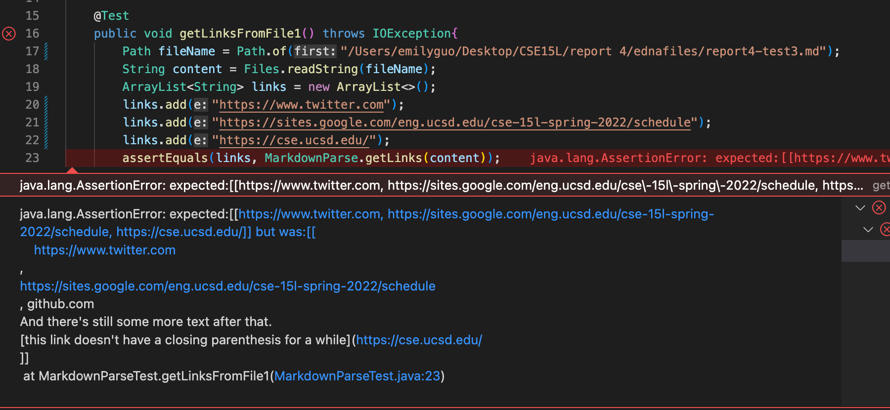

# Lab Report4 Week8

[Other reports here](https://yuxinguo13.github.io/cse15l-lab-reports/)

[My markdown-parse repository](https://github.com/yuxinguo13/markdown-parser.git)

[Reviewed markdown-parse repository](https://github.com/ednavho/ednafiles)

### Expected output
#### Snippet 1

#### Snippet 2

#### Snippet 3

### Actual output
#### My implementation
##### Snippet 1
- Expected: 
- Actual: 
- Reason:

##### Snippet 2
- Expected: 
- Actual: 
- Reason:

##### Snippet 3
- Expected: 
- Actual: 
- Reason:

#### Reviewed implementation
##### Snippet 1
- Expected: 

- Actual: 
- Reason: Fail to find the correct links. In the code, the author determine the link according to the index of thebracket, both [] and (). But in our markdown text file, the link is inbetween the code marker, \`\` the [] brakets are separted. Therefore, the markdown file actually won't have url.com as the link, but according to the code it would. And for the last link, the () is not immediatly after the [] that why the code would have some problems in finding the correct link.

##### Snippet 2
- Expected: 

- Actual: 
- Reason: For the first link, it's correct, but the code fail to get the last two links. For 'a.com(())', since the code find the link according to the existence of the [] and () bruckets, the first existence of the ) would be considered the end of the link, and this is why the code would have only 'a.com(('. For the last link, the code didn't find the link. This is because, behind the first end ], it'd not (. So, the code doesn't consider the this line of code as linke.

##### Snippet 3
- Expected: 

- Actual: 
- Reason: For the first link, the content is correct, but since there are have so many spaces in-between lines, the code didn'tgit rid of all the blank spaces in the link. Also, for the last one, there are actually two linkes, but the code only consider this as only one link, and this is why we have so much information as the third link. All the information between the open ( and last end ) are included as the link.

 

### Questions
  1. 
Do you think there is a small (<10 lines) code change that will make your program work for snippet 1 and all related cases that use inline code with backticks? If yes, describe the code change. If not, describe why it would be a more involved change.

Do you think there is a small (<10 lines) code change that will make your program work for snippet 2 and all related cases that nest parentheses, brackets, and escaped brackets? If yes, describe the code change. If not, describe why it would be a more involved change.

Do you think there is a small (<10 lines) code change that will make your program work for snippet 3 and all related cases that have newlines in brackets and parentheses? If yes, describe the code change. If not, describe why it would be a more involved change.

