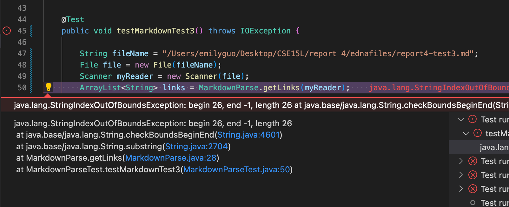

# Lab Report4 Week8

[Other reports here](https://yuxinguo13.github.io/cse15l-lab-reports/)

[My markdown-parse repository](https://github.com/yuxinguo13/markdown-parser.git)

[Reviewed markdown-parse repository](https://github.com/ednavho/ednafiles)

### Expected output
#### Snippet 1

#### Snippet 2

#### Snippet 3

### Actual output
#### My implementation
##### Snippet 1
- Expected: 
- Actual: 
- Reason: Since my code has check the [] first and then if ( is after the ], I would consider it as the link nor I will consider the link not exist. That's why my code would consider url.com as the link. For the second and the third ones, my code would successfully obtain them. For the last one, since the element after the first ] is not ), my not work well for this link.

##### Snippet 2
- Expected: 
- Actual: 
- Reason: My code could get the first a.com since this is a regular expression [] and (). But for second one, my code not work well for this one, since the ) after the ( is not actually the end of the link. Thus, this would lead me to find only (( in the link. And for the last link, the sign after first ] is still a ], thus my code will directly break the while loop and not consider it as the link.

##### Snippet 3
- Expected: 
- Actual: 
- Reason: In my code, the output show that the code is out of index. By checking my code, I found that my code only considre the situation that each line of link is in the single line, including the [] and (). Thus, for this example, my code doesn't work in this case.

#### Reviewed implementation
##### Snippet 1
- Expected: 

- Actual: 
- Reason: Fail to find the correct links. In the code, the author determine the link according to the index of thebracket, both [] and (). But in our markdown text file, the link is inbetween the code marker, \`\` the [] brakets are separted. Therefore, the markdown file actually won't have url.com as the link, but according to the code it would. And for the last link, the () is not immediatly after the [] that why the code would have some problems in finding the correct link.

##### Snippet 2
- Expected: 

- Actual: 
- Reason: For the first link, it's correct, but the code fail to get the last two links. For 'a.com(())', since the code find the link according to the existence of the [] and () bruckets, the first existence of the ) would be considered the end of the link, and this is why the code would have only 'a.com(('. For the last link, the code didn't find the link. This is because, behind the first end ], it'd not (. So, the code doesn't consider the this line of code as linke.

##### Snippet 3
- Expected: 

- Actual: 
- Reason: For the first link, the content is correct, but since there are have so many spaces in-between lines, the code didn'tgit rid of all the blank spaces in the link. Also, for the last one, there are actually two linkes, but the code only consider this as only one link, and this is why we have so much information as the third link. All the information between the open ( and last end ) are included as the link.

 

### Questions
  1. Yes, only 10 line of change can help to make my program work for snippet 1. I could change the whether the bruckets are in the \`\` code fence, it it's in the fence then I won't consider it as the link, And also I could check for each [ brucket and the corresponding ] bruckets in that line, and whether there is a ] brucket followed by (). If there is, then adding the content inside the () into the link list.
  2. Yes, for the second example, I would check the () using stack. For each ( there should be a corresponding ), and all the information within the most outter () is the link that wewant. And for the last example, I would also stack to check the pairring of [], only the most outside [] is what we want.
  3. It's hard to do this in only 10 lines. Since my whole program is based on the assumption that all the hyperlink and its [] will be only in one line, and the scanner reader in my program also only read one single line at one time, so it's really hard to change my code in only 10 lines to make it work for snippet 3. 
